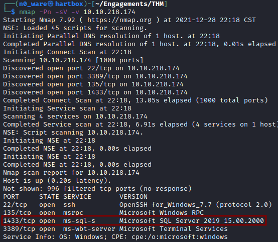
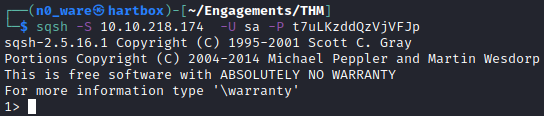
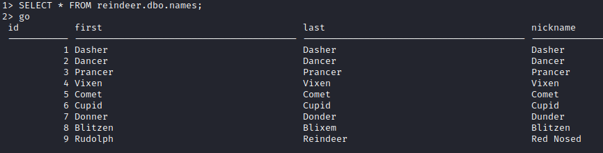

# TryHackMe - Advent of Cyber 2021 - Day X
## Where are the Reindeers?
> Edward Hartmann
> December 28, 2021

***<u>Refs/Links:</u>***
- [Advent of Cyber 2021 TOC](Advent%20of%20Cyber%20Table%20of%20Contents.md)  
-  Tags[^1]
-  Flag[^2]

[^1]: #sql #nmap #rdbms 
[^2]:  *Question 1:* `1433`
					*Question 2:* `>1`
					*Question 3:* ` `
					*Question 4:* ` `
					*Question 5:* ` `
					*Question 6:* ` `
					*Question 7:* ` `
					*Question 8:* ` `

## TOC
- [Question 1](#Question-1)
- [Question2](#Question-2)
- [Question 3](#Question-3)
- [Question 4](#Question-4)
- [Question 5](#Question-5)
- [Question 6](#Question-6)

## Walkthrough
In this box, we are told that we have lost access to Santa's Reindeer Schedule stored in a [Relational Database Management System (RDBMS)](../../../knowledge-base/concepts/sql_rdbms.md) and need to not only regain access, but first find it on the system using [Nmap](../../../tools_and_tricks/tools/nmap_usage.md).

> **Note:** If you are familiar with `MySQL` commands, those will not apply here. You are using `MSSQL` over `sqsh`.

### Question-1
[Top](#TOC)

Firstly, we need to find the server. Since we don't know what port the service is running on, we'll need to version scan. Also, because we know it is a Windows system that won't respond to `ping`, we need a "*pingless*" [Nmap](../../../tools_and_tricks/tools/nmap_usage.md) on the top 1000 ports (default Nmap setting). Run the command `nmap -Pn -sV -v <TARGET_IP>`

### Question-2
[Top](#TOC)

With the service located, we need to login. Using an interactive database shell called `sqsh` (*swkish*), we can access the server over the command-line. Run the command `sqsh -S <TARGET_IP> -U sa -P t7uLKzddQzVjVFJp` where `-S` is the target IP, `-U` is the username, and `-P` is the password. If successful we will get a prompt similar to a terminal but in different syntax.

> The "*prompt*" is what you see right before your cursor

### Question-3
[Top](#TOC)

Now that we have access, let's get some information. Note that after each query we type, you must follow it with `go` and that each query itself ends with a `;`. Otherwise, it will continue expecting more on the same query. 

First, the DB Admin told us the `reindeer` database contains three tables &mdash; `names, presents, schedule`. We want some data from`reindeer`. 

Run the command `SELECT * FROM reindeer.dbo.names;` followed by `go`. 

### Question-4
[Top](#TOC)
### Question-5
[Top](#TOC)
### Question-6
[Top](#TOC)

 
 
 
 
 
 
 
 
 
 
 
 
 
 
 
 
 
 
 
 
 
 
 
 
 
 
 
 
 
 
 
 
 
 
 
 
 
 
 
 
 
 
 
 
 
 
 
 
 
 
 
 
 
 
 
 
 
 
 
 
 
 
 
