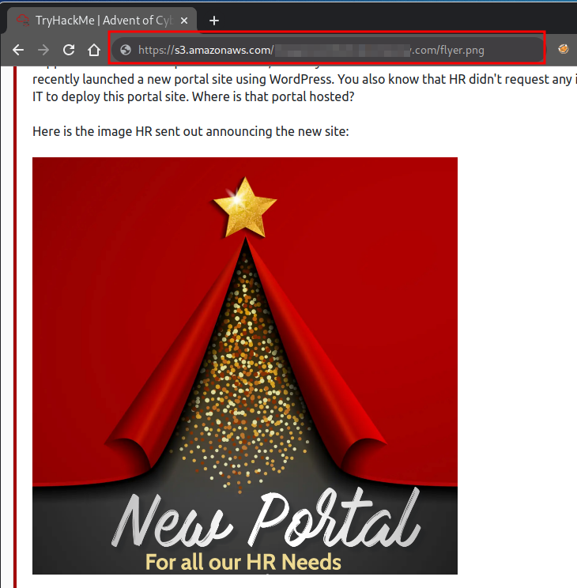

# TryHackMe - Advent of Cyber 2021 - Day 17
## Elf Leaks
> Edward Hartmann
> January 5, 2022

***<u>Refs/Links:</u>***
- [Advent of Cyber 2021 TOC](Advent%20of%20Cyber%20Table%20of%20Contents.md)  
-  Tags[^1]
-  Flag[^2]

[^1]: #s3 #insecuredesign #permissions #aws
[^2]: *Question 1:* `images.bestfestivalcompany.com`  
					*Question 2:* ` `  
					*Question 3:* ` `  
					*Question 4:* ` `  
					*Question 5:* ` `  
					*Question 6:* ` `  
					*Question 7:* ` `  
					*Question 8:* ` `  

## TOC
- [Question 1](#Question-1)
- [Question 2](#Question-2)
- [Question 3](#Question-3)
- [Question 4](#Question-4)
- [Question 5](#Question-5)
- [Question 6](#Question-6)
- [Question 7](#Question-7)
- [Question 8](#Question-8)

## Walkthrough
In this box we are tasked with investigated how The Grinch gained access to employee personal information. We know that HR recently made available an HR portal via AWS S3 and we suspect that it is the source of the leak. 

### Question-1
[Top](#TOC)
The first question asks us to identify the website the HR team used to send out their announcement. To find the source of any image, simple right-click and choose "Copy image address." Paste the copied text anywhere to view the URL of the image. 

In our case, we only want the middle portion, the subdomain, domain name, and top level domain of the URL. `example.example.xyz`. 

### Question-2
[Top](#TOC)
### Question-3
[Top](#TOC)
### Question-4
[Top](#TOC)
### Question-5
[Top](#TOC)
### Question-6
[Top](#TOC)
### Question-7
[Top](#TOC)
### Question-8
[Top](#TOC)

***Congratulations on completing this box!***  

See you at the next one &mdash; [Advent of Cyber 3 Day X](AoC-2021_DayXX.md)
 
 
 
 
 
 
 
 
 
 
 
 
 
 
 
 
 
 
 
 
 
 
 
 
 
 
 
 
 
 
 
 
 
 
 
 
 
 
 
 
 
 
 
 
 
 
 
 
 
 
 
 
 
 
 
 
 
 
 
 
 
 
 
