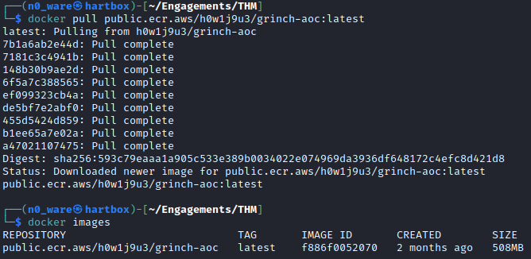
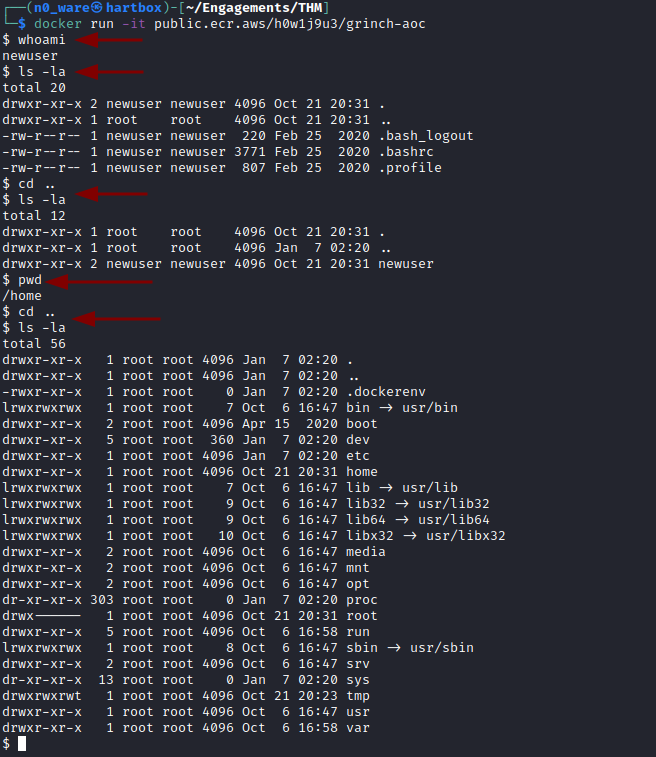

# TryHackMe - Advent of Cyber 2021 - Day X
## Title
> Edward Hartmann
> DATE

***<u>Refs/Links:</u>***
- [Advent of Cyber 2021 TOC](Advent%20of%20Cyber%20Table%20of%20Contents.md)  
-  Tags[^1]
-  Flag[^2]

[^1]: #docker #aws
[^2]: *Question 1:* `docker images`  
					*Question 2:* ` `  
					*Question 3:* ` `  
					*Question 4:* ` `  

## TOC
- [Question 1](#Question-1)
- [Question 2](#Question-2)
- [Question 3](#Question-3)
- [Question 4](#Question-4)

## Walkthrough
In this lab we are interacting with `docker` images hosted on AWS Elastic Container Registry. An image has been erroneously made available to the public and it is our task to exploit it. 

> To install Docker on a Kali instance, run the following commands:
```
sudo apt update
sudo apt install -y docker.io
sudo systemctl enable docker --now

## To add yourself to the docker group to use without sudo
sudo usermod -aG docker $USER
```

To start this lab, we are going to `pull` the image provided for us so we can run it locally. We could instead skip the `pull` and use the `run` command, but it will still download first then initialize. 

```
docker pull public.ecr.aws/h0w1j9u3/grinch-aoc:latest
```



### Question-1
[Top](#TOC)

The first question asks us what command we would use to list the container images stored in your local registry. The answer is given in the guide in the beginning steps, `docker images`. 

See the result of this command in the image above.

We can `run` the docker image and begin using as a proper container that simulates a shell with the following command. The input field of this particular shell starts with a `$` and you can see the commands ran noted in the image. 

```
docker run -it public.ecr.aws/h0w1j9u3/grinch-aoc
```



Exit the Docker terminal with the `exit` command. 
### Question-2
[Top](#TOC)

The next is another simple question, asking us how we would save a docker image as a `.tar` archive. This is also available in the beginning guide and is accomplished with `docker save`.

Let's go ahead and save the remote container to our system now. 
```
docker save -o aoc.tar public.ecr.aws/h0w1j9u3/grinch-aoc:latest
```

### Question-3
[Top](#TOC)


### Question-4
[Top](#TOC)


***Congratulations on completing this box!***  

See you at the next one &mdash; [Advent of Cyber 3 Day X](AoC-2021_DayXX.md)
</br>
</br>
</br>
</br>
</br>
</br>
</br>
</br>
</br>
</br>
</br>
</br>
</br>
</br>
</br>
</br>
</br>
</br>
</br>
</br>
</br>
</br>
</br>
</br>
</br>
</br>
</br>
</br>
</br>
</br>
</br>
</br>
</br>
</br>
</br>
</br>
</br>
</br>
</br>
</br>
</br>
</br>
</br>
</br>
</br>
</br>
</br>
</br>
</br>
</br>
</br>
</br>
</br>
</br>
</br>
</br>
</br>
</br>
</br>
</br>
</br>
</br>
</br>
