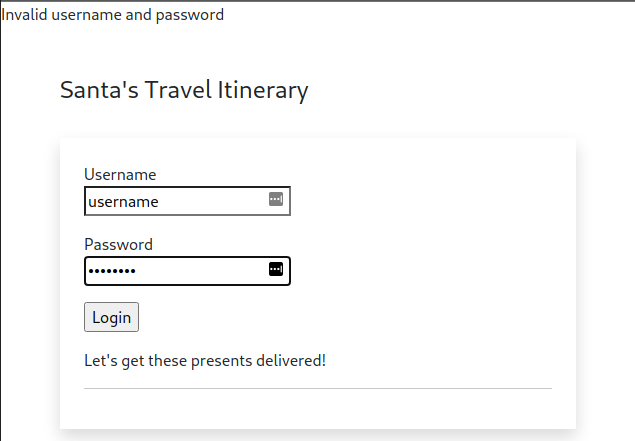
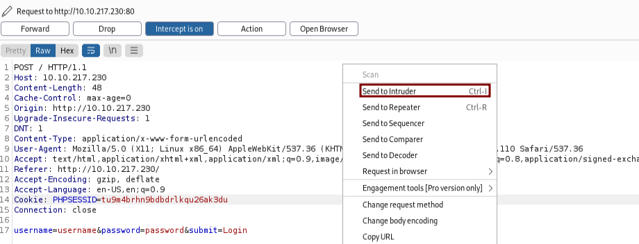
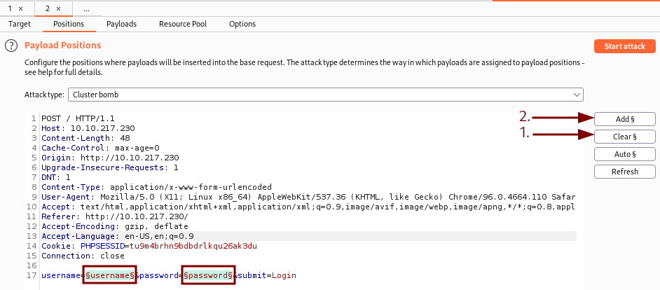
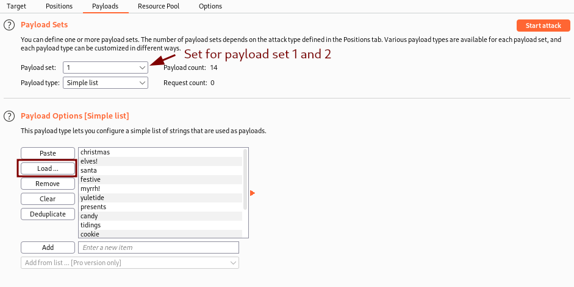
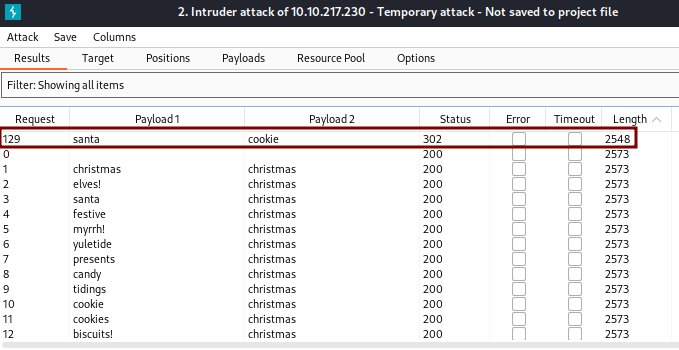

# TryHackMe - Advent of Cyber 2021 - Day 4
> Edward Hartmann
> December 22, 2021

<u>Refs/Links:</u>
- [Advent of Cyber 2021 TOC](_AoC-2021_TOC.md)  
-  Tags[^1]
-  Flag[^2]
-  A [note](#Note) on Cluster Bomb.

[^1]: #authentication #fuzzing #burp #webapp #weakpasswords #clusterbomb
[^2]: THM{SANTA_DELIVERS}
## Walkthrough
> If you would prefer to use a personal machine for this lab, simply copy (with the built in clipboard) or re-type the short the wordlist provided for you on the attack box at `/root/Rooms/AoC3/Day4/passwords.txt` into a file on your local machine and ensure your VPN is on. 

In this lab we are given a web application with a login page vulnerable o [fuzzing](../../../knowledge-base/concepts/fuzzing.md) with [BurpSuite](../../../tools/BurpSuite.md). We start by heading to the IP provided in a browser, starting BurpSuite, and enabling FoxyProxy. These are all pre-installed in the TryHackMe attack box. BurpSuite is pre-installed on Kali Linux, but a proxy for your web browser will need to be configured if you perform this lab locally.

The first thing we see on the login page is a login page for *Santa's Travel Itinerary*. To fuzz or brute force a login page with BurpSuite, we first need to capture a request sent to the login screen. Enter in some dummy information, turn on your intercept within BurpSuite, and attempt to login. 



When you check your intercept on BurpSuite you should see a packet like the one below. This is what we want to use with the BurpSuite utility *Intruder*. Right-click the screen and select "Send to Intruder". 



Once on the intruder screen, click the `Positions` tab and set the `Attack Type` to *Cluster Bomb*. Find the items highlighted in light green. These are the current attack positions. We need to change this. Press the `Clear` button on the right side first. Highlight the boxes in red int he image (yours may have different text inside them) and click the `Add` button. The highlighted items are what BurpSuite will replace with our attack payload when using cluster bomb. 

In this attack mode, BurpSuite will iterate through the entire list, matching each option in two separate payload sets one by one until each pair has been attempted. This results in an exponential combination of possible usernames and password as each *n*<sup>th</sup>  word in the wordlist results in *n*<sup>*2*</sup> possible combinations. 



Before we can attack, we need to set a payload. Click the `Payloads` button and either load or paste your wordlist from TryHackMe into BurpSuite. Do this for *Payload set:* 1 and 2. Once your image looks like the one below, you can click `Start Attack`. 



This attack will take some time. When fuzzing, you can expect to see most of the attempts produce similar results. It is the outliers are are looking to identify. As you can see below, the 129th request produced a `Status` and `Length` that deviated from the norm. This tells me I might have a match for the username and password for this page. Not knowing either piece of information going into this test, these results are really, really good. 



Returning to the login screen, the username and password combination `santa:cookies` gave us administrator access to Santa's Itinerary.


Congratulations on finishing this box!

#### Note
***A note on Cluster Bomb and Exponential Combinations***   </br>
When it comes to using this utility, think of it as if we had four items in our list:
```
1
2
3
4
```

With cluster bomb, our possible combinations are 4<sup>2</sup>
```
11 12 13 14 
21 22 23 24
31 32 33 34
41 42 43 44
```

We have 16 total combinations with only 4 items on the wordlist. With the wordlist `rockyou` , containing about 14 million passwords, that is over 205 **trillion** possible combinations. A bit unwieldy. Even a small wordlist with 100 items still results in 10,000 possible combinations, making cluster bomb a use-case specific tool that must be used with a carefully curated wordlist if you hope to achieve a positive result in any reasonable amount of time. If you are using BurpSuite free, the rate it tests combinations is throttled, further increasing the time to test the list. 

When attacking software applications, fuzzing for unexpected behavior, wordlists can be expected to be enormous as you are attempting to test for an enormous amount of possible data combinations and intending to produce error. When password brute forcing, however, we are fighting against account lockouts and time. Keep this in mind as you use cluster bomb. More often, it is best to attempt to enumerate a username and use the *Sniper* utility to target the username or usernames you enumerated. 

> While this lab box refers to the action we are taking as *Fuzzing*, I believe this to more along the lines of *Brute Forcing*. I typically associate *Fuzzing* with testing for bugs in code by providing unusual or malformed data to an application, web or otherwise, and doing it very quickly to produce a diverse set of interactions and a wide range of results. Regardless....

</br>
</br>
</br>
</br>
</br>
</br>
</br>
</br>
</br>
</br>
</br>
</br>
</br>
</br>
</br>
</br>
</br>
</br>
</br>
</br>
</br>
</br>
</br>
</br>
</br>
</br>
</br>
</br>
</br>
</br>
</br>
</br>
</br>
</br>
</br>
</br>
</br>
</br>
</br>
</br>
</br>
</br>
</br>
</br>
</br>
</br>
</br>
</br>
</br>
</br>
</br>
</br>
</br>
</br>
</br>
</br>
</br>
</br>
</br>
</br>
</br>
</br>
</br>
