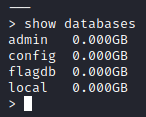
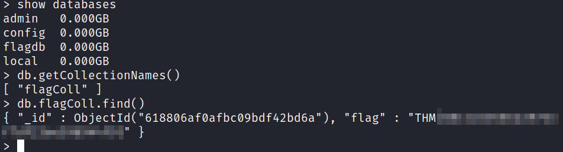
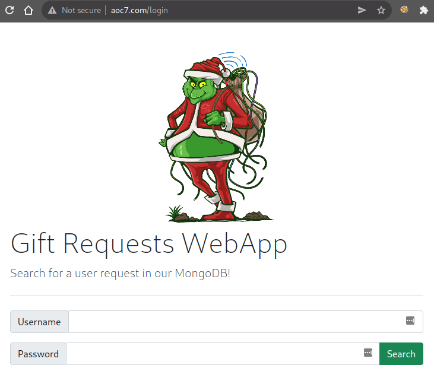
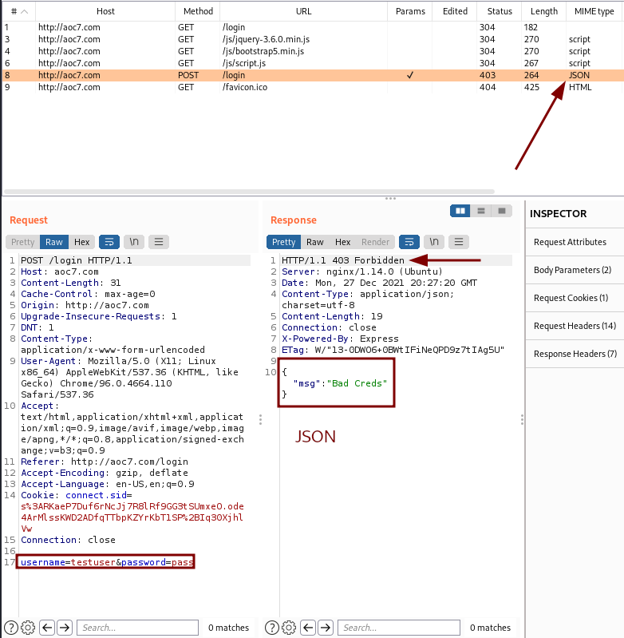
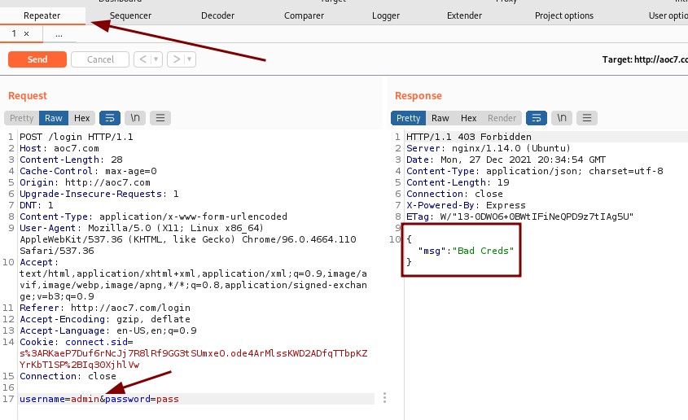
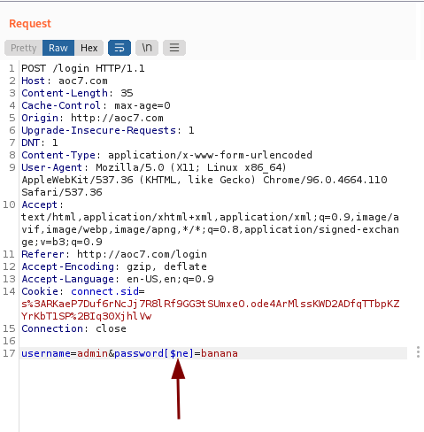
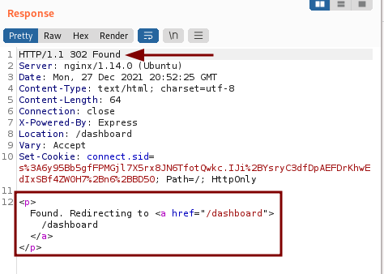
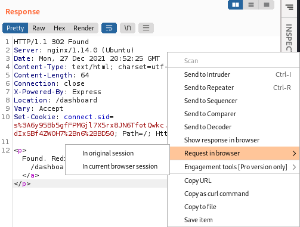
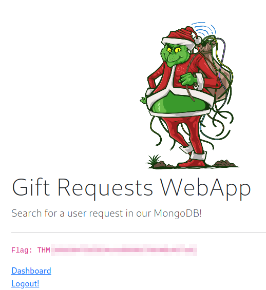

# TryHackMe - Advent of Cyber 2021 - Day 7
## Migration without Security
> Edward Hartmann
> December 27, 2021

***<u>Refs/Links:</u>***
- [Advent of Cyber 2021 TOC](_AoC-2021_TOC.md)  
-  Tags[^1]
-  Flag[^2]

[^1]: #nosql #injection #webapp #database 
[^2]: *Flag 1* THM{8814a5e6662a9763f7df23ee59d944f9} 
					*Flag 2* THM{b6b304f5d5834a4d089b570840b467a8}

## Walkthrough

In this box are are going to be exploring [NoSQL Injection](../../../knowledge-base/vulnerabilities/nosql_injection.md) via a **MongoDB** [NoSQL](../../../knowledge-base/concepts/nosql.md) server. Begin by accessing the URL in your browser and starting an `nmap` against the server with the standard enumeration flags.


Nothing of note except for a secondary `ssh` service running on port `2222` and a `node.js` server running on port `8000` We know already that the secondary `ssh` is for practicing the beginning of the walkthrough. We may investigate the `node.js` server later. 

> I have altered my `/etc/hosts` file to set the IP equal to `aoc7.com`

## Question-1

First, we need to connect to the remote server via `ssh` on port `2222` with the credentials `thm : tryhackme`. 


Start an interactive session with the **MongoDB** server with `mongo` on the command line. The default port is `27017` and the command will use this unless otherwise specified. 

> The `mongo` command is being replaced with `mongosh` but this box is not configured for the new command. 

Once connected, we want to view the databases we have access to. Run `show databases`



As you can see, we have four &mdash; admin, config, flagdb, and local. Lets `use` the `flagdb` database, seems pretty obvious. From there, we can get the `Collection` names and find all values in that collection. The process from the beginning is simple:
- `show databases`
- `use flagdb`
- `db.getCollectionNames()`
- `db.flagColl.find()`

You will see the flag returned from the collection. 




## Question-2
For flag two, we need to gain access via the browser. The first thing we see is a login page. 



To bypass the login page via [injection](../../../knowledge-base/vulnerabilities/injection.md), we are going to need a tool such as [BurpSuite](../../../tools_and_tricks/tools/BurpSuite.md) to iterate requests more easily, track responses, and take advantage of various utilities built in to the tool. Remember to turn on your proxy. 

To start, we'll send a test login request via a `POST` to the system and observe the response. Use any combination of `username:password`. Our attempt fails, and in the browser, you will see a simple message stating `{"msg":"Bad Creds"}`. What we have here is a *NoSQL* structured response in `JSON` notation. A better view of this comes from BurpSuite in the `Proxy > HTTP history` view.



Here we confirm some assumptions:
- The `403` error confirms we are unauthorized
- We see on line `8` of the `HTTP History` that were received `JSON` data. 
- The application accepted our `username` and `password` with those fields as names.
- We got `Bad Creds` in the `JSON` data back.

> Note that we **did not** see any vulnerable entry point in the URL. 

Let's try logging in as admin. Right-click the HTTP request we sent and choose `Send to repeater`. You'll find the `Repeater` utility in the top menu bar. If you are confident in your injection, you can simply try and modify an intercepted request.

> See the note on [BurpSuite](../../../tools_and_tricks/tools/BurpSuite.md) for additional information on `Repeater`

Here, we can quickly send requests using the same template requests but with small modifications, and view the history of those requests and the responses we received. For example, I changed the username to `admin` and received a similar message as before. 



Let's try some basic [NoSQL Injection](../../../knowledge-base/vulnerabilities/nosql_injection.md) using common commands. Assuming there is an `admin` user, let's attempt to get the `password` field to evaluate to `true`. 

Unlike brute-force password attacks, we want to alter the `key` in the command, not just the `value`. In this case the two `keys` are `username` and `password`. The query the application is sending to the server probably looks something like 

```
# Browser
username=admin&password=password

# Backend
db.users.findOne({username:"admin", password:"password"})
```

If we want to alter the `password` field, we can do so in BurpSuite by adding  the `[$ne]` function right after `password`. See the example in the picture. 



This essentially turns the `POST` request into 

```
# Browser
username=admin&password[$ne]=password

# Backend
db.users.findOne({username:"admin", password:{"$ne":"password"}})
```

Send the modified request, and you'll see the response changes. We are given a `302 Found` response, indicating a redirect, and a new message body indicating we have access to the `/dashboard` page now. Looks like a success! 



Right-click this response, select `Request in browser > In original session`, copy the URL, and paste into the browser. You are now logged in as admin! Retrieve the first flag for your troubles. 





#### Using Intercept
Since know this method of injection worked, another way of accessing the page is to simply intercept the original login request, modify the intercepted request with the `[$ne]` function, and forward the request on. This will also give us admin access to the dashboard. 

## Question-3

> To accomplish question 2, you must have gotten browser access to the admin dashboard. See [Question-1](#Question-1) if you skipped over the steps that involved [BurpSuite](../../../tools_and_tricks/tools/BurpSuite.md) to gain access via the browser. 


##### Not part

</br>
</br>
</br>
</br>
</br>
</br>
</br>
</br>
</br>
</br>
</br>
</br>
</br>
</br>
</br>
</br>
</br>
</br>
</br>
</br>
</br>
</br>
</br>
</br>
</br>
</br>
</br>
</br>
</br>
</br>
</br>
</br>
</br>
</br>
</br>
</br>
</br>
</br>
</br>
</br>
</br>
</br>
</br>
</br>
</br>
</br>
</br>
</br>
</br>
</br>
</br>
</br>
</br>
</br>
</br>
</br>
</br>
</br>
</br>
</br>
</br>
</br>
</br>

[^1]: 
[^2]: 