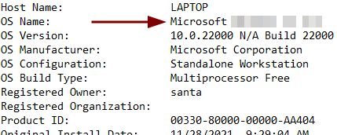
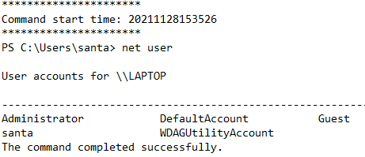
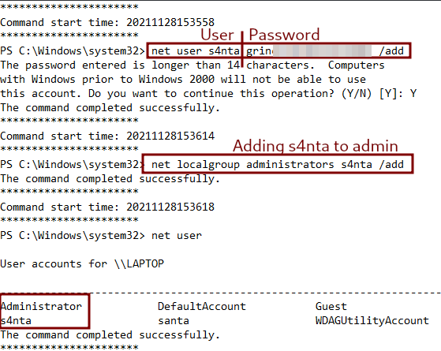
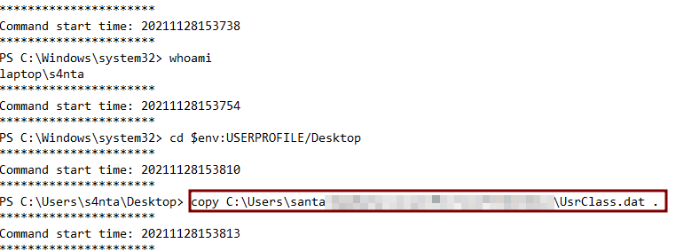
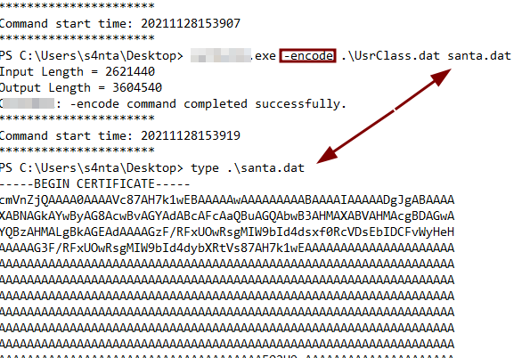
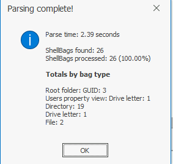
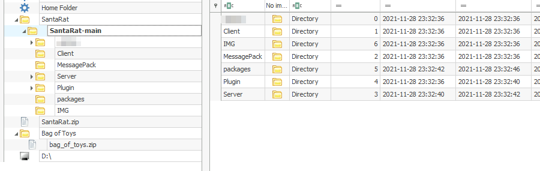

# TryHackMe - Advent of Cyber 2021 - Day 8
## Santa's Bag of Toys
> Edward Hartmann
> DATE

***<u>Refs/Links:</u>***
- [Advent of Cyber 2021 TOC](_AoC-2021_TOC.md)  
-  Tags[^1]
-  Flag[^2]

[^1]: #powershell #windows #logs #lolbas
[^2]: *Flag 1:* `Microsoft Windows 11 Pro`  
					*Flag 2:* `grinchstolechristmas`  
					*Flag 3:* `C:\Users\santa\AppData\Local\Microsoft\Windows\UsrClass.dat`  
					*Flag 4:* `certutil.exe`  
					*Flag 5:* `.github`  
					
## TOC
- [Question-1](#Question-1)
- [Question-2](#Question-2)
- [Question-3](#Question-3)
- [Question-4](#Question-4)
- [Questions-5 and 6](#Questions-5%20and%206)
-
## Walkthrough

In this scenario, Santa's laptop has gone missing, and all we have access to are some [PowerShell](../../../tools_and_tricks/cli_utilities/powershell.md) transcription logs and an analysis machine. 

> Either start the attack box or login via your own VM through `RDP` using `xfreerdp` &mdash; `xfreerdp /u:Administrator /p:grinch123! /v:YOUR_IP_HERE`

### Question-1

Our first task is to identify the `OS Name` of Santa's laptop. This is the operating system. The first (earliest log file contains the answer &mdash; `PowerShell_transcript.LAPTOP._s3k_jad.20211128153510`. Someone ran the  `systeminfo`command on this PC. 

### Question-2

The second question asks us about the password set for a "backdoor" account and we are asked to parse through the logs to search for some suspicious activity. There are some indicators of questionable behavior via some of the commands ran in the logs. 

In the same log file as question 1, we see someone enumerated the user accounts on the laptop via the `net user` command. 

In the log, named `PowerShell_transcript.LAPTOP.k_dg27us.20211128153538`, we see the creation of a user account named `s4nta` with a long password, and that someone added this user as an `administrator`. 

If you scroll down further, you can see the actor confirmed this via the `wmic` command to check the `sid` or `security group identifier` field. 

### Question-3

In the third log file, `PowerShell_transcript.LAPTOP.Zw6PA+c4.20211128153734` we see evidence of someone copying some files as the backdoor user `s4nta`. First, they confirm they are logged in as the new user, navigate to the `Desktop` directory,  then copy a file named `UsrClass.day` from its home directory to the `Desktop`.

> Note: The portion of the `cd` command with `$env:USERPROFILE` is an "alias" or "variable" for the users current home environment, and for this user, that is `C:\Users\s4nta`.

Note that the `.` after the file path basically says "my current location." The command esentially says `copy the_file_at_this_path HERE`. The actor confirms the successful copy with `dir -Force`, which displays all files in the directory. The first `dir` did not show the file. 

### Question-4

The next question asks us to identify something called a "Living off the Land" binary or [LOLBAS](../../../tools_and_tricks/cli_utilities/living_off_the_land_binaries_lolbas.md), which refers to native Windows binaries that exist on the system and are signed by Microsoft. These binaries are perfect for malicious actors as they are very unlikely, relatively speaking, to be flagged by endpoint detection software as they exist natively on the system. 

> You can read more about LOLBAS at their GitHub page &mdash; [LOLBAS Project](https://lolbas-project.github.io/)

Simply search for the `.exe` file used shortly after the copy and you'll find the LOLBAS in question. 

### Questions-5 and 6

It looks like our attacker base64 [encoded](../../../knowledge-base/concepts/encoding_decoding.md) the `UsrClass.dat` file. We can user CyberChef locally to decode this (it is on the Desktop). 

`TL;DR`, **ShellBags** are artifacts within the Windows registry that maintain user preferences when viewing folders within the Windows Explorer GUI. The long on the short of it is if you view a file and delete it, the file may be gone, but the [ShellBags](../../../knowledge-base/concepts/shellbags.md) related to the file or folder may still be there, giving an analyst an idea as to what actions were taken on the computer before an attempt to delete any tracks. 

> According to TryHackMe, it is worth reading about `ShellBags`, a type of artifact contained in this folder and very useful for forensics. You can find more at this link [SheHacks_KE](https://shehackske.medium.com/windows-shellbags-part-1-9aae3cfaf17) and a brief snipped from the website at the [ShellBags](../../../knowledge-base/concepts/shellbags.md) note. 

Start by copying **all** of the data between `----BEGIN CERTIFICATE-----` and `-----END CERTIFICATE-----` in the log file. It is easiest to click at the beginning or ending of the data and hold <kbd>Shift</kbd> while scrolling up to select it all. 

Launch CyberChef, paste in the data (it will be large) and choose `From Base64` to decode. Download the file to your Desktop. This is a huge file, and it will not be human-readable, which is why we are using the executable to parse it. I saved it as `UsrDat Decoded`.

Next, run the `ShellBagsExplorer.exe` file located in the `ShellBagsExplorer` folder on the Desktop. Open your downloaded file with `File` > `Load offline hive`.  

Immediately we get some good parsing information. 

Under the `Desktop` folder we can immediately see a file called `SantaRat.zip` and a directory called `SantaRat`. These are both obviously suspicious. 

We also see Santa's `Bag of Toys` folder. Looking at the `Desktop`, I don't see either of those two folders. It seems that both have since been removed from the system. While I cannot access either of them, I can begin tracking down the source of the breach &mdash; `SantaRat`

I can tell from the files in SantaRat > SantaRat-main that the files were assible via a popular internet code repository &mdash; GitHub. 
 
 
 
 
 
 
 
 
 
 
 
 
 
 
 
 
 
 
 
 
 
 
 
 
 
 
 
 
 
 
 
 
 
 
 
 
 
 
 
 
 
 
 
 
 
 
 
 
 
 
 
 
 
 
 
 
 
 
 
 
 
 
 

[^1]: 
[^2]: 