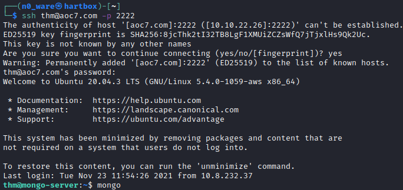

# TryHackMe - Advent of Cyber 2021 - Day 7
## Migration without Security
> Edward Hartmann
> December 27, 2021

***<u>Refs/Links:</u>***
- [Advent of Cyber 2021 TOC](_AoC-2021_TOC.md)  
-  Tags[^1]
-  Flag[^2]

[^1]: t
[^2]: t

## Walkthrough

In this box are are going to be exploring [NoSQL Injection](../../../knowledge-base/vulnerabilities/no_sql_injection.md) via a **MongoDB** [NoSQL](../../../knowledge-base/concepts/nosql.md) server. 

First, we need to connect to the remote server via `ssh` on port `2222` with the credentials `thm : tryhackme`. 

Start an interactive session with the **MongoDB** server with `mongo` on the command line. The default port is `27017` and the command will use this unless otherwise specified. 

> The `mongo` command is being replaced with `mongosh` but this box is not configured for the new command. 

Once connected, we want to view the databases we have access to. Run `show databases`

As you can see, we have four &mdash; admin, config, flagdb, and local. Lets `use` the
 
 
 
 
 
 
 
 
 
 
 
 
 
 
 
 
 
 
 
 
 
 
 
 
 
 
 
 
 
 
 
 
 
 
 
 
 
 
 
 
 
 
 
 
 
 
 
 
 
 
 
 
 
 
 
 
 
 
 
 
 
 
 

[^1]: 
[^2]: 