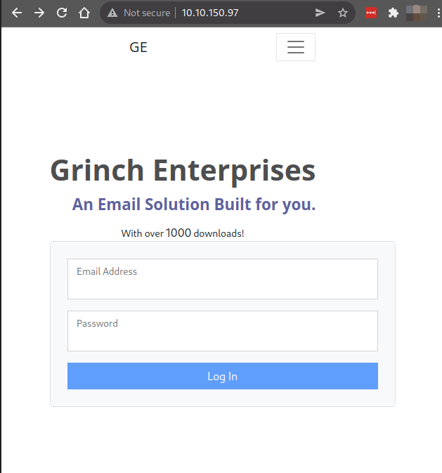
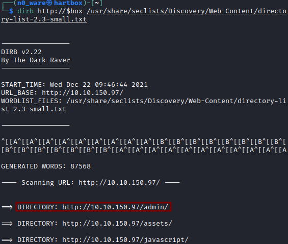
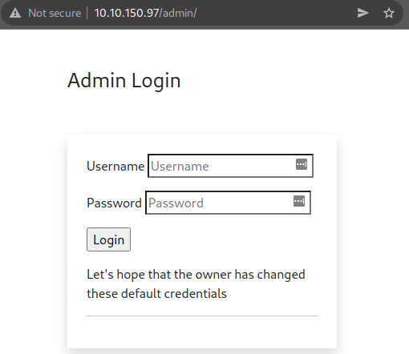
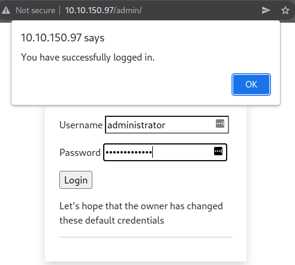
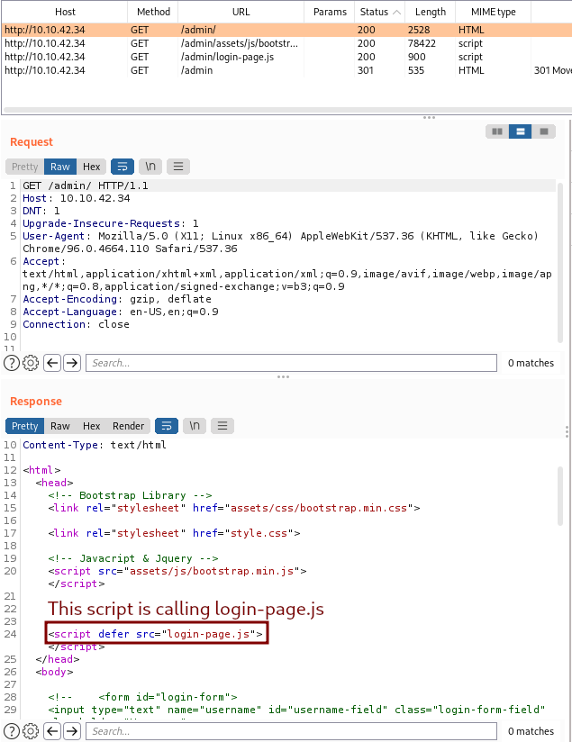
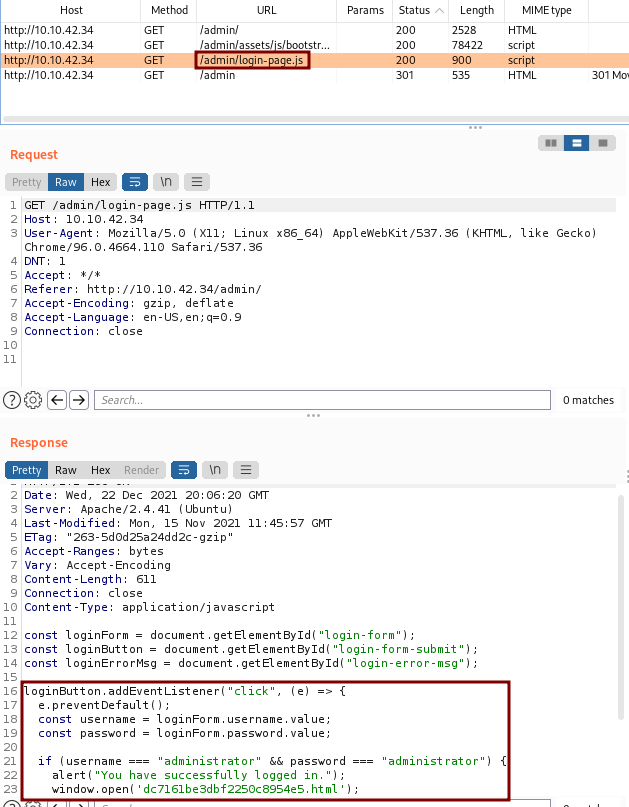
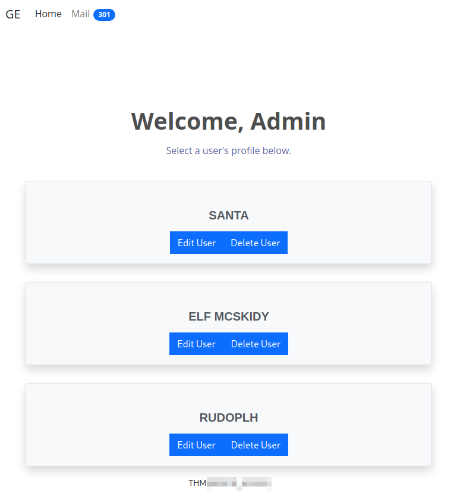

# TryHackMe - Advent of Cyber 2021 - Day 3
## Christmas Blackout (Web-Exploitation)
> Edward Hartmann
> December 22, 2021

<u>Refs/Links:</u>
- [Advent of Cyber 2021 TOC](Advent%20of%20Cyber%20Table%20of%20Contents.md)  
-  Tags[^1]
-  Flag[^2]

[^1]: #authentication #brokenaccesscontrol #insecuredesign #contentdiscovery #webapp 
[^2]: THM{ADM1N_AC3SS}

## Walkthrough
We are given a website vulnerable to enumeration to attempt directory busting and authentication brute forcing. 



The first thing we are going to do is attempt to enumerate hidden directories to [discover hidden content](../../../knowledge-base/concepts/web_tech/content_discovery.md). Using [dirbuster](../../../tools_and_tricks/tools/red/dirbuster.md) and [Seclists](../../../tools_and_tricks/cli_utilities/seclists.md) is our attack path. 

```
dirb http://10.10.150.97 /usr/share/wordlists/seclists/Discovery/Web-Content/directory-list-2.3-small.txt
```

Quickly, `dirb` identifies the directory `/admin` as the admin dashboard. 





Some basic manual guessing and we are able to find a valid admin login using the combination `administrator:administrator`. 



While inspecting the target with [BurpSuite's](../../../tools_and_tricks/tools/red/BurpSuite.md), we can also identify that when loading the `/admin` page, it also calls a `javascript` function `/admin/loginpage.js`. Investigating this script plainly gives out the administrator username and password. 





Once we are successfully authenticated, we have access to the Admin dashboard and the Flag for the box. 




***Congratulations on completing this box!***  

See you at the next one &mdash; [Advent of Cyber 3 Day 4](AoC_2021_Day04.md)
</br>
</br>
</br>
</br>
</br>
</br>
</br>
</br>
</br>
</br>
</br>
</br>
</br>
</br>
</br>
</br>
</br>
</br>
</br>
</br>
</br>
</br>
</br>
</br>
</br>
</br>
</br>
</br>
</br>
</br>
</br>
</br>
</br>
</br>
</br>
</br>
</br>
</br>
</br>
</br>
</br>
</br>
</br>
</br>
</br>
</br>
</br>
</br>
</br>
</br>
</br>
</br>
</br>
</br>
</br>
</br>
</br>
</br>
</br>
</br>
</br>
</br>
</br>
