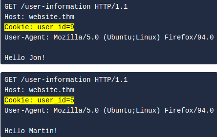

# Session ID
These are [cookies](cookies.md) that preseve sessions such as logins. Usually a string of random, hard to guess numbers such as `5db28452c4161cf88c6f33e57b62a357` which the webserver securely uses to retreieve user information and validate access to a session. 

Less experienced developers may store user information in the cookie its self, such as the user's ID. Changing the value of this cookie could result in displaying another user's information. See below for an example of how this might look.

#sessionid #cookies 