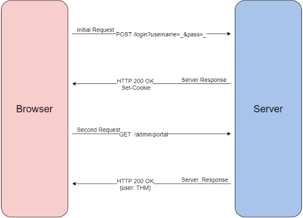

# Authentication
## Description
Essentially the processes of verifying a user's identity to confirm without a doubt (ideally) that the user is who they say they are. Identity for authentication can be proven in a number of ways, including:
1. Using a known set of credentials sent to a server, such as a username and password
2. Token authentication (i.e., unique pieces of encrypted text like cookies, pre-generated API tokens, etc.)
3. Biometric authentication (fingerprints, voices, etc. )

Often conflated with authorization, but it is very different. Being *authorized* means that one is allowed, permitted,  or otherwise expected to have access to a certain piece of content or collection of assets/resources. Being *authenticated* means that the identity of a user is confirmed **and the user is authorized to access what they are authenticated for**. Authorization determines what the authenticated user can access. Authentication relates to the **C** in the **CIA** triad. It is used when protections and/or accountability is required for a set of resources. 

## Web

### Cookies
*<u>Cookie used for authentication</u>*

The authentication processes can be as follows:
1. A request such as a login usually made as a [post](post.md)
2. Server verifies it received data and sets a unique cookie
	- Type of value determined by either best-practices or the web developer.
3. Once assigned, as as long as it lives in your browser, all future GET requests will use that cookie to identify you and your access using [deserialization](web/deserialization.md).

#authentication #authorization #webapp #tokens #cookies 