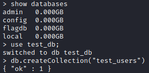
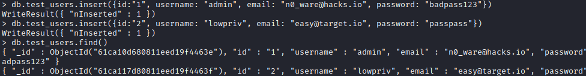
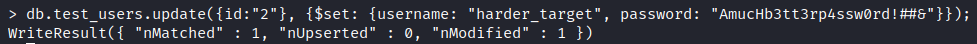
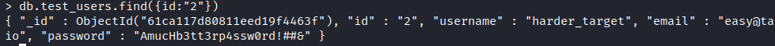
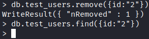

# NoSQL
###### *This example is based on the common **MongoDB** database system. *
Tags[^2] 

[^2]: #rdbms #nosql #sql #database

## Description
Where *SQL* databases are based on uniform structure and tabular based, *NoSQL* databases (aka "not only SQL") are non-tabular databases and store data differently than relational tables. NoSQL databases come in a variety of types based on their data model. The main types are document, key-value, wide-column, and graph. They provide flexible schemas and scale easily with large amounts of data and high user loads.

NoSQL databases are non-relational and come in a variety of formats[^1].

[^1]: https://www.mongodb.com/nosql-explained

-   **Document databases** store data in documents similar to JSON (JavaScript Object Notation) objects. Each document contains pairs of fields and values. The values can typically be a variety of types including things like strings, numbers, booleans, arrays, or objects.
-   **Key-value databases** are a simpler type of database where each item contains keys and values.
-   **Wide-column stores** store data in tables, rows, and dynamic columns.
-   **Graph databases** store data in nodes and edges. Nodes typically store information about people, places, and things, while edges store information about the relationships between the nodes.

In a document database, for example, a **collection** of users will contain various **documents** that contain various **fields** that contain **key-value** pairs used to access the data. 

## SQL vs NoSQL

### Structure
In a RDBMS (relational database management system), data is modeled in tables. In *NoSQL*, data are likely stored as *objects* in a format such as `JSON`. A NoSQL database such as **MongoDB** will have collections, documents, and fields. 

In a situation where we want to store a database of *users* and *hobbies*,  the data will be stored differently depending on the type of database. 

In an *RDBMS*, we'd likely have two databases, one for each, in a relational database. Bringing the data together would require a join

**Users**

| ID | first_name | last_name | cell | city |
| :-: |  :-: |  :-: |  :-: |  :-: |
| 1 | Leslie | Yepp | 8168751 | Tulsa | 

**Hobbies**

| ID | user_id | hobby | 
| :-: | :-: | :-: | 
| 10 | 1 | scrapbooking | 
| 11 | 1 | eating burgers |
| 12 | 1 | working |

In a *NoSQL* database, the data model depends on the type of DB. In a *document database* like **MongoDB**, we'd store it in `JSON`. 

```
{ 
	"_id": 1, 
	"first_name": "Leslie", 
	"last_name": "Yepp", 
	"cell": "8125552344", 
	"city": "Pawnee", 
	"hobbies": ["scrapbooking", "eating waffles", "working"] 
}
```

*In comparing the two:*
- **Collections** are similar to tables or views in MySQL
- **Documents** are similar to rows or records in MySQL
- **Fields** are similar to columns in MySQL

### Commands
To start interacting with a local **MongoDB** server, simply type `mongo` or `mongosh`, the latter for improved usability and compatibility. The former will be deprecated on the next release. 


*Comparing basic operators in **MongoDB** to **MySQL:***
- `$and` equals `and`
- `$or` equals `OR`
- `$eq` equals `=`


*Basic usage:*
- `show databases` &mdash; list available databases
- `use` &mdash; to connect to an existing database or create a new one
- `db.createCollection("COLLECTION_NAME")` &mdash; creates a new collection in the database we are connected to 
- `db.COLLECTION.insert({key:"value", key: "value", key: "value"})` &mdash; this function creates a document in whatever `COLLECITON` we entered with the command. 
- `db.COLLECITON.find(PARAMETERS)` &mdash; selects documents within `COLLECITON` that match parameters, or finds all if empty
- `db.COLLECITON.update({key:'value"}, {$set: {key: "value"}});'` &mdash; within the chosen `COLLECITON`, find a document with a specific `key:value` pair and update the chosen `key` with a new `value` using the `$set` function. 
	- e.g., find an `_id` with the value `2` and update the `username` to `"admin2"` &mdash; `db.users.update({_id: "1"}, {$set: {username: "admin2"}})`
- `db.COLLECTION.remove({key:"value"})` &mdash; removes the selected `key:value`
- `db.COLLECTION.drop()` &mdash; ends the session with the current collection.

*Creating a DB and Collection*
- `use test_db;`
- `db.createCollection("test_users")`


*Creating and Finding Documents*
- `db.test_users.insert({id:"1", username: "admin", email: "n0_ware@hacks.io", password: "badpass123"})
WriteResult({ "nInserted" : 1 })`
- `db.test_users.insert({id:"1", username: "admin", email: "n0_ware@hacks.io", password: "badpass123"})
WriteResult({ "nInserted" : 1 })`
- `db.test_users.find()`


*Updating a Document*

- `db.test_users.update({id:"2"}, {$set: {username: "harder_target", password: "AmucHb3tt3rp4ssw0rd!##&"}});
WriteResult({ "nMatched" : 1, "nUpserted" : 0, "nModified" : 1 })`

*Finding a Specific Document*
- `db.test_users.find({id:"2"})`


*Remove a Document*
- `db.test_users.remove({id:"2"})`

