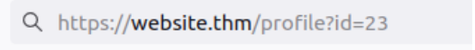
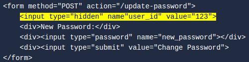
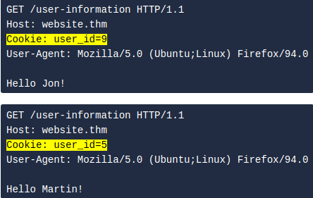

# Insecure Direct Object Reference (IDOR)
###### Tags[^1]
IDOR stands for Insecure Direct Object Reference and is a type of access control vulnerability. An [access control](../concepts/access%20control.md) [vulnerability](../concepts/vulnerability.md) is when an attacker can gain access to information or actions not intended for them. An IDOR vulnerability can occur when a web server receives [user-supplied_input](../concepts/user-supplied_input.md) to retrieve objects (files, data, documents), and too much [trust](../concepts/trust.md) as been placed on that input data, and the web application does not [validate](../concepts/validate.md) whether the user should, in fact, have access to the requested object.

**TL;DR:** 

Change user supplied data to get access you should not have

## Vulnerability

Product, user, service, or other unique identifier in a URL is a **must test**. IDOR can reveal sensitive information and potentially give usually restricted access to certain functions. 

### Locating IDOR 

#### **Three places**
##### In a [query](../concepts/query.md) component
Data is passed in the URL when making a request to a website

**Protocol**: https:// **Domain**: website.thm **Page**: /profile **Query Component:** id=23

The `/profile` page is being requested, and the parameter id with the value of `23` is being passed in the query component. This page could potentially be showing us personal user information, and by changing the `id` parameter to another value, we could view other users data.

##### Post Variables
Forms that [post](../concepts/web/post.md) on a website can reveal vulnerable fields if inspected. Often, in hidden fields. If able, changing the field in the `POST` request can give access elsewhere. 

Use a `POST` editor such as [BurpSuite](../../tools/BurpSuite.md) to modify the request as you send it

##### Cookies
[Cookies](../concepts/web/cookies.md) are often used to save sessions/logins. Usually, it involves a [session_id](../concepts/web/session_id.md). Sometimes, these session id's can be hard coded using the *User ID* and offer an exploit path. 

[^1]: #idor #accesscontrol #userinput #query #queries #post #session #bounty #cookies 
