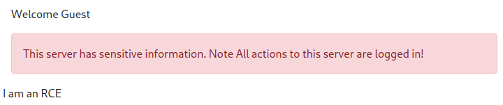

# Local File Inclusion

## TOC-Local
- [Finding and Testing](#Finding%20and%20Testing)
	- [Finding in HTTP Query Parameters](#Finding%20in%20HTTP%20Query%20Parameters)
	- [Testing in HTTP Query Parameters](#Testing%20in%20HTTP%20Query%20Parameters)
- [Examples](#Examples)
	- [Basic LFI Techniques](#Basic%20LFI%20Techniques)
	- [PHP](#PHP)
		- [PHP Filter](#PHP%20Filter)

## TOC-GH
- [Finding and Testing](#Finding-and-Testing)
	- [Finding in HTTP Query Parameters](#Finding-in-HTTP-Query-Parameters)
	- [Testing in HTTP Query Parameters](#Testing-in-HTTP-Query-Parameters)
- [Examples](#Examples)
	- [Basic LFI Techniques](#Basic-LFI-Techniques)
	- [PHP](#PHP)
		- [PHP Filter](#PHP-Filter)
	- [Remote Code Execution](#Remote%20Code%20Execution)

Tags [^1]

[^1]: #webapp #lfi #get #post #query #insecuredesign #encoding #userinput #rce #php #injection 
## Description
Local File Inclusion (LFI) vulnerabilities can be found in web applications. **LFI** allows attackers to "include" and read local files on the server, such as cryptographic keys, passwords, API's, and other sensitive data. **LFI** can result in sensitive data exposure, a former [*Owasp Top Ten*](https://owasp.org/www-project-top-ten/) vulnerability, now included in the number two spot with [*Cryptographic Failures*](cryptographic_failures.md)

This type of vulnerability occurs when developer's lack security awareness and instead focus solely on convenience. Developers need to read local files within a specific page, on occasion. If they include those files without the right input validation, an **LFI** vulnerability exists as an attacker can call the file with malicious [user-supplied input](../concepts/user_supplied_input.md)

Once discovered, if the file has the right permissions, the attacker can read the file. This can include both files sensitive to the application **and** files holding sensitive user information. 

Further, if we can inject or write to a file on the system, we can use **LFI** to obtain [**remote code execution (RCE)**](remote_code_execution_rce.md).
## Finding and Testing

###  Finding in HTTP Query Parameters
This is the attackers main point of interest to see if they can manipulate the parameters of an `HTTP` [query](../concepts/queries.md) to input and inject attack payloads and see how the application responds and find an entry point. Often these are `HTTP` [GET](../concepts/web/GET.md) and [POST](../concepts/web/POST.md) parameters that pass arguments and data to a web app to perform a specific operation. 


Once an entry point for potential **LFI** is identified, you need to understand how the data could be processed inside the application. Once found, specific testing for vulnerability types begins manually or with automation. 

<u>*Below is some `PHP` that is vulnerable to **LFI***</u>

```
<?PHP
	include($_GET["some_file"]);
?>
```

This code uses a `GET` request via the URL parameter `file` to include that file on the page. Sending an HTTP request that mirrors this `PHP` code could load the content of any file, such as `welcome.txt`, as long as the file is available in that directory.

`http://vulnsite.io/index.php?file=welcome.txt`

> In `PHP` code, the following functions cause this type of vulnerability
> - include
> - require
> - include_once
> - require_once

There are many entry points, others including &mdash; `User-Agent`, Cookies, session, and other HTTP headers. 

<u>*Valuable files to try and read include:*</u>
- /etc/shadow
- /etc/passwd
- /etc/issue
- /etc/group
- /etc/hosts
- /etc/motd
- /etc/mysql/my.cnf
- /proc/[0-9]*/fd/[0-9]* &mdash; (first number is the PID, second is the file descriptor)
- /proc/self/enviro
- /proc/version
- /proc/cmdline


### Testing in HTTP Query Parameters
Once the entry point for **LFI** is found, we start looking for files that are nearly *guaranteed* to be on the system, such as OS files. For example, trying to find `/etc/passwd` on Linux systems as it is guaranteed to be readable. Once you find one file, you know you can probably find others.

Most files of interest are unlikely to be located in the same directory as the web page we are on, such as `index.html`. More likely, we have to try some creative relative file references. 
- Direct file inclusion, such as `/etc/passwd`
- Indirect references using `../` to move up a directory. Each set of `../` moves up one directory
- We can bypass basic filtering that will strip sets of `../` by "wrapping" it in another set with `....//`. The inner set is stripped, leaving the outer set intact. 
- URL [encoding](../concepts/encoding_decoding.md) such as double encoding. 

Your success in exploiting **LFI** fully depends on the type of web application server configuration. Depending on this, we can get anything from a complete failure to full [RCE](remote_code_execution_rce.md).

## Examples

### Basic LFI Techniques
*Some examples of **LFI** attempts with different techniques:**

*This is using [path traversal](path_traversal.md) to achieve **LFI***
```
https://vulnsite.io/search.php?file=/etc/passwd
https://vulnsite.io/settings.php?file=../../../../../../etc/passwd
https://vulnsite.io/custom.php?file=../../../../../../etc/passwd%00 
https://vulnsite.io/admin.php?file=....//....//....//....//etc/passwd 
https://vulnsite.io/status.php?file=%252e%252e%252fetc%252fpasswd
```
> The last example here is URL double-encoded. Try it in [CyberChef!](https://gchq.github.io/CyberChef/#recipe=URL_Decode()URL_Decode()&input=JTI1MmUlMjUyZSUyNTJmZXRjJTI1MmY)

### PHP 
When dealing with `PHP`, you can use *PHP-supported wrappers*. `PHP` provides several methods for transmitting data (input/output) that enable `PHP` to read the data. 

#### PHP Filter
The `PHP` wrapper *filter*  is used in **LFI** to read the actual `PHP` page content. In normal circumstances, you cannot read the contents of  `PHP` file as it is executed when it is called because the server attempts to execute the code on the **server** side, never displaying the underlying text on the **client** side. The **PHP Filter** is used to so that we can process this code in some way. We can use this to our advantage for reading files, such as `php://filter/resources=/etc/passwd`. 

With `/etc/passwd`, we are dealing with text, not `PHP` wrapped code, so it displayed for us without issue. If you want to read *actual* source-code, you'll need to encode it while filtering, otherwise, the server will produce an error as it tries to run it, or just run the code. See this example from [TryHackMe's Advent of Cyber 3 Day 6 challenge](https://tryhackme.com/room/adventofcyber3)


We need to encode this file as it is read with filter so the web page cannot run it and we can decode it somewhere else to read it. 

Executing the command `php://filter/read=string.rot13/resource` or `php://filter/convert.base64-encode/resource` on your target `PHP` code should produce better results by printing the data encoded. 

Below is another example from the same TryHackMe room referenced above.


You can even paste in **encoded** `PHP` code and use a wrapper to decode it on the web page, possible leading to [Remote Code Execution](remote_code_execution_rce.md) using a piece of code like `page.php?file=data://text/plain;base64,SSBhbSBhbiBSQ0UK==`



> More wrappers can be found here &mdash; [PHP Documentation - Wrappers](https://www.php.net/manual/en/wrappers.php.php) 

### Remote Code Execution
**LFI** can be used to generate [remote code execution](remote_code_execution_rce.md) depending on the type of files we have access to. 

In the case of log files, this is called [log poisoning](log_poisoning.md) , a technique used to gain **RCE** on a web server. The attack needs a malicious payload injected into a services log files, such as *Apache, SSH*, or others. Once there, the **LFI** vulnerability is used to call the injected log file, executing the malicious payload. This vulnerability requires multiple variables to align, meaning we need good enumeration beforehand to identify the vulnerability. It also requires some knowledge of how web applications work. 

For example, a user that can include a malicious payload in an Apache log file via a `User-Agent` header sent via an `HTTP` request. Via `SSH`, this can be done via the username. Both require poor [user input](../concepts/user_supplied_input.md) sanitation. 

Once the malicious log is captured, we simply need to be able to access the log file to run the script. 

Let's say we can access a log file, and we are able to pull a log that tells us precisely what the log stores. We identify that the log stores four headers &mdash; username, IP address, `User-Agent`, and the page visited. 

Attackers can control the `User-Agent` field when interacting with a web application, editing it with a crafted `HTTP` request using the `curl` command with the `-A` flag. Since we can control what `User-Agent` is sent to the log file, sending a test to the web application allows us to confirm if it works

`curl -A "Testing for RCE" https://vulnsite.io/login.php`

