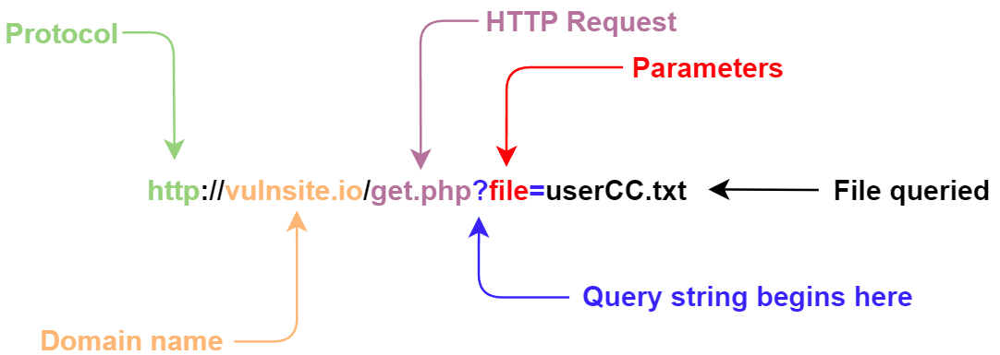

# Local File Inclusion

Tags [^1]

[^1]: #webapp #lfi #get #post #query #insecuredesign 
## Description
Local File Inclusion (LFI) vulnerabilities can be found in web applications. **LFI** allows attackers to "include" and read local files on the server, such as cryptographic keys, passwords, API's, and other sensitive data. **LFI** can result in sensitive data exposure, a former [*Owasp Top Ten*](https://owasp.org/www-project-top-ten/) vulnerability, now included in the number two spot with [*Cryptographic Failures*](cryptographic_failures.md)

This type of vulnerability occurs when developer's lack security awareness and instead focus solely on convenience. Developers need to read local files within a specific page, on occasion. If they include those files without the right input validation, an **LFI** vulnerability exists as an attacker can call the file with malicious [user-supplied input](../concepts/user_supplied_input.md)

Once discovered, if the file has the right permissions, the attacker can read the file. This can include both files sensitive to the application **and** files holding sensitive user information. 

Further, if we can inject or write to a file on the system, we can use **LFI** to obtain [**remote code execution (RCE)**](remote_code_execution_rce.md).
## Finding and Testing

###  Finding in HTTP Query Parameters
This is the attackers main point of interest to see if they can manipulate the parameters of an `HTTP` [query](../concepts/queries.md) to input and inject attack payloads and see how the application responds and find an entry point. Often these are `HTTP` [GET](../concepts/web/GET.md) and [POST](../concepts/web/POST.md) parameters that pass arguments and data to a web app to perform a specific operation. 



Once an entry point for potential **LFI** is identified, you need to understand how the data could be processed inside the application. Once found, specific testing for vulnerability types begins manually or with automation. 

<u>*Below is some `PHP` that is vulnerable to **LFI***</u>

```
<?PHP
	include($_GET["some_file"]);
?>
```

This code uses a `GET` request via the URL parameter `file` to include that file on the page. Sending an HTTP request that mirrors this `PHP` code could load the content of any file, such as `welcome.txt`, as long as the file is available in that directory.

`http://vulnsite.io/index.php?file=welcome.txt`

> In `PHP` code, the following functions cause this type of vulnerability
> - `include`
> - `require`
> - `include_once`
> - `require_once`

There are many entry points, others including &mdash; User-Agent, Cookies, session, and other HTTP headers. 

<u>*Valuable files to try and read include:*</u>
- /etc/shadow
- /etc/passwd
- /etc/issue
- /etc/group
- /etc/hosts
- /etc/motd
- /etc/mysql/my.cnf
- /proc/[0-9]*/fd/[0-9]* &mdash; (first number is the PID, second is the file descriptor)
- /proc/self/enviro
- /proc/version
- /proc/cmdline


### Testing in HTTP Query Parameters
Once the entry point for **LFI** is found, we start looking for files that are nearly *guaranteed* to be on the system, such as OS files. For example, trying to find `/etc/passwd` on Linux systems as it is guaranteed to be readable. Once you find one file, you know you can probably find others.

Most files of interest are unlikely to be located in the same directory as the web page we are on, such as `index.html`. More likely, we have to try some creative relative file references. 
- Direct file inclusion, such as `/etc/passwd`
- Indirect references using `../` to move up a directory. Each set of `../` moves up one directory
- We can bypass basic filtering that will strip sets of `../` by "wrapping" it in another set with `....//`. The inner set is stripped, leaving the outer set intact. 
- URL [encoding](../concepts/encoding_decoding.md) such as double encoding. 

## Examples
*Some examples of **LFI** attempts with different techniques:**
```
https://vulnsite.io/search.php?file=/etc/passwd
https://vulnsite.io/settings.php?file=../../../../../../etc/passwd
https://vulnsite.io/custom.php?file=../../../../../../etc/passwd%00 
https://vulnsite.io/admin.php?file=....//....//....//....//etc/passwd 
https://vulnsite.io/status.php?file=%252e%252e%252fetc%252fpasswd
```